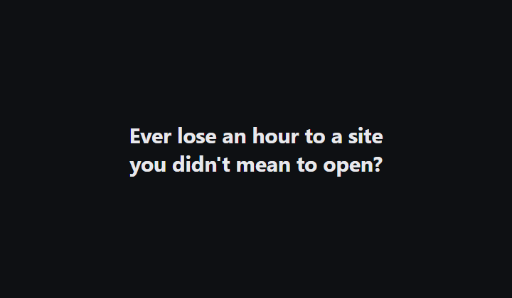

# Mindful Access Bandit

### Ever lose an hour to a site you didn't mean to open?

Mindful Access Bandit is a browser extension that puts a small, learning
gatekeeper in front of the sites you choose to restrict — Instagram,
YouTube, whatever pulls you in. It doesn't just block them outright. It
decides, in the moment, whether a few minutes of access makes sense right
now — and it gets better at that call the more you use it.

## What it does for you

- **Pick the sites that get to you.** Everything else on the web is
  untouched.
- **No flat "no."** Ask, and it decides — deny, or a short grant — based
  on the time of day and how you've actually been using that site lately.
- **Denied isn't stuck.** A short wait and you can ask again. If you
  genuinely need the page, there's a deliberately effortful override —
  not a one-tap bypass.
- **It learns.** Every session feeds back into the model, so over time it
  gets sharper about when access is actually worth granting.
- **Nothing leaves your device.** All of it — sites, history, the model
  itself — stays local.

## Install (unpacked, developer mode)

1. Open `edge://extensions` (or `chrome://extensions`).
2. Turn on **Developer mode**.
3. Click **Load unpacked** and select this folder.
4. Click the extension icon, add a site you want to restrict, and try
   visiting it.

## Want the technical details?

This README is deliberately just the pitch. For how the bandit actually
works — the algorithm, the reward function, every formula and default,
the code layout, and how to run the tests — see
**[DESIGN.md](DESIGN.md)**.

## License

MIT — see [LICENSE](LICENSE).
